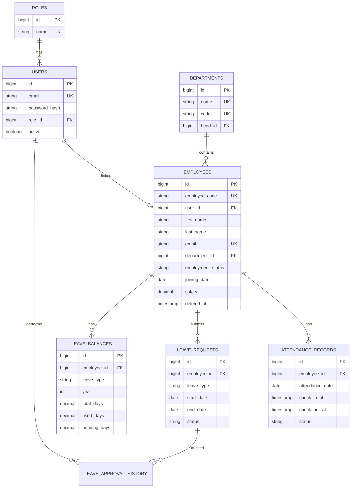

# Database Design

## ER Diagram (Mermaid)

## Migrations

- `V1__init_schema.sql` — Tables, indexes, FKs, seed roles
- `V2__seed_data.sql` — Sample departments and employees (demo)

Application `DataInitializer` ensures demo users have correct BCrypt passwords on startup.
